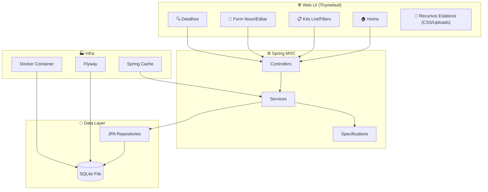

# 🤖 Gundam Collection Administrator 2.0

<div align="center">
  
</div>

<div align="center">

[](https://adoptium.net)
[](https://spring.io/projects/spring-boot)
[](https://www.thymeleaf.org/)
[](https://www.sqlite.org/)
[](https://flywaydb.org/)
[](https://www.docker.com/)

</div>

---

**Gestor completo de coleção de Gunpla (Gundam)**, com cadastro de kits, fotos, filtros, catálogos fixos e relatórios simples.  
🎨 **UI com tema inspirado no RX‑78‑2**, suporte a **i18n (PT/EN/JA)** e uploads estáticos.

---

## 📑 Índice

- [🤖 Gundam Collection Administrator](#-gundam-collection-administrator-20)
  - [📊 Dados do Projeto](#-dados-do-projeto)
  - [🏗️ Arquitetura](#️-arquitetura)
  - [📂 Estrutura do Projeto](#-estrutura-do-projeto)
  - [☕ Programação (Java Spring)](#-programação-java-spring)
  - [🌐 Funcionamento da Parte Web](#-funcionamento-da-parte-web)
  - [✨ Funcionalidades](#-funcionalidades)
  - [🗺️ Modelagem de Domínio](#️-modelagem-de-domínio)
  - [⚙️ Requisitos e Setup](#️-requisitos-e-setup)
  - [🐳 Execução com Docker](#-execução-com-docker)
  - [💻 Execução Local (sem Docker)](#-execução-local-sem-docker)
  - [🤖 Suporte MCP](#-suporte-mcp)
  - [🛣️ Rotas Principais](#️-rotas-principais)
  - [📦 Camadas e Pacotes](#-camadas-e-pacotes)
  - [🔄 Migrações de Banco](#-migrações-de-banco)
  - [🛠️ Troubleshooting](#️-troubleshooting)
  - [🚀 Roadmap](#-roadmap)
  - [📄 Licença](#-licença)

---

## 📊 Dados do Projeto

- **Nome**: 🤖 Gundam Collection Administrator
- **Stack**: Spring Boot 3.5, Java 17, Thymeleaf, Spring Data JPA, Flyway, SQLite, Gradle
- **Porta padrão**: `8080`
- **Banco de dados**: SQLite (`gundam.db`)
  - 📂 Localização no Host: `./database/gundam.db`
  - 🐳 Localização no Container: `/app/data/gundam.db`
  - 📝 Modo: WAL (Write-Ahead Logging) ativado
- **Diretório de uploads**: `uploads/` (servido em `/uploads/**`)
- **Internacionalização (i18n)**: 🇧🇷 `pt-BR`, 🇺🇸 `en`, 🇯🇵 `ja` (alternância via `?lang=`)

---

## 🏗️ Arquitetura



---

## 📂 Estrutura do Projeto

- `src/main/java/br/com/gundam`
  - 🚀 `GundamApplication.java` — bootstrap da aplicação
  - ⚙️ `config/` — `WebConfig` (recursos estáticos, i18n, locale), `CacheConfig`
  - 🎮 `controller/` — `HomeController`, `GundamKitController`
  - 🧠 `service/` — `GundamKitService`, `FileStorageService`
  - 💾 `repository/` — repositórios JPA (inclui queries de relatório)
  - 🔍 `spec/` — Specifications para filtros dinâmicos
  - 📦 `model/` — entidades JPA (GundamKit, Grade, Escala, AlturaPadrao, Universo)
- `src/main/resources`
  - 🖼️ `templates/` — views Thymeleaf (`layout.html`, `home.html`, `kits/*`, `sobre.html`, `relatorios.html`)
  - 🎨 `static/css/` — estilos (`global.css`)
  - 🔄 `db/migration/` — migrações Flyway `V1..V5` (Compatíveis com SQLite)
  - ⚙️ `application.yml` — configuração da aplicação
- 🐳 `compose.yaml` — orquestração do container da aplicação
- 🐳 `Dockerfile` — definição da imagem Docker
- 🤖 `mcp-settings.json` — configuração para integração com Model Context Protocol
- 🐘 `build.gradle` — dependências e plugins

---

## ☕ Programação (Java Spring)

- **Controllers (Spring MVC)**: tratam rotas, populam `Model` e retornam nomes de templates.
- **Services**: concentram regras de negócio e cache.
- **Repositories (Spring Data JPA)**: CRUD + `JpaSpecificationExecutor` + queries JPQL.
- **Configurações**: WebConfig (uploads estáticos), CacheConfig.

---

## 🌐 Funcionamento da Parte Web

- **Templates Thymeleaf**: layout base em `layout.html`.
- **Listagem com filtros**: GET paramétrico em `/kits`.
- **Uploads**: salvos em volume persistente.

---

## 🐳 Execução com Docker

Esta é a forma recomendada de executar o projeto.

### Pré-requisitos

- Docker instalado

### Passo a Passo

1. **Subir a aplicação**:

   ```bash
   docker compose up -d --build
   ```

2. **Acessar**:
   - 🌐 Web: [http://localhost:8080](http://localhost:8080)

3. **Verificar Banco de Dados**:
   - O arquivo do banco de dados será criado automaticamente em `./database/gundam.db`.
   - As migrações do Flyway rodarão automaticamente no início.

### Parar a aplicação

```bash
docker compose down
```

---

## 💻 Execução Local (sem Docker)

Caso queira rodar a aplicação diretamente no Host (Windows/Linux/Mac) via Gradle, você precisa **sobrescrever a URL do banco** para apontar para o arquivo local, já que o caminho `/app/data` do container não existe na sua máquina.

🚨 **Importante**: Certifique-se de que o **Docker está parado** (`docker compose down`) antes de rodar localmente, caso contrário a porta **8080** estará ocupada e ocorrerá erro.

**Comando (Windows Powershell):**

```powershell
.\gradlew.bat bootRun --args="--spring.datasource.url=jdbc:sqlite:./database/gundam.db"
```

**Comando (Bash):**

```bash
./gradlew bootRun --args="--spring.datasource.url=jdbc:sqlite:./database/gundam.db"
```

> **Nota**: O Java 17 deve estar instalado e configurado no `JAVA_HOME`.

---

## 🤖 Suporte MCP

O projeto inclui um arquivo de configuração para **Model Context Protocol (MCP)**.

- **Arquivo**: `mcp-settings.json`
- **Configuração**: Adicione o conteúdo deste arquivo ao seu cliente MCP (ex: Claude Desktop `config.json`).
- Isso permite que agentes de IA leiam a estrutura do banco e façam queries diretamente no arquivo `database/gundam.db`.

---

## ✨ Funcionalidades

- ✅ **Cadastro completo de Kits** (modelo, fabricante, preço, data, horas, urls, fotos de capa/caixa/montagem)
- ✅ **Catálogos fixos**: Grades, Escalas, Alturas Padrão
- ✅ **Universo/Linha do Tempo** (UC, CE, AC, etc.) e Observações longas
- 🔍 **Filtros na listagem**: Modelo (like), Grade, Universo, Período de Compra, Paginação
- 🖼️ **Upload de imagens** (Persistência garantida via volume Docker)
- 🔄 **Migrações** (Flyway mode SQLite) e dados seed

---

## 🛠️ Troubleshooting

- **⚠️ Erro de Schema Validation**:
  - Se ver erros como `SchemaManagementException: wrong column type encountered`, verifique se `spring.jpa.hibernate.ddl-auto` está definido como `none` no `application.yml`. Isso ocorre porque o Hibernate espera `BIGINT` mas o SQLite reporta `INTEGER`.
  
- **🔒 Permissões de Escrita**:
  - Certifique-se que o usuário do Docker tem permissão de escrita na pasta `./database` e `./uploads` do host.

- **🚫 Banco Travado (Lock)**:
  - O SQLite em modo WAL deve evitar locks, mas se ocorrer, reinicie o container.

---

## 📄 Licença

MIT.

Made with ❤️ using **Spring Boot** + **Thymeleaf**.
