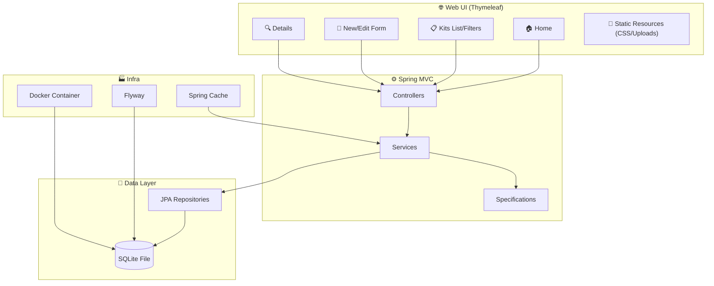

# 🤖 Gundam Collection Administrator 2.0

<div align="center">
  
</div>

<div align="center">

[](https://adoptium.net)
[](https://spring.io/projects/spring-boot)
[](https://www.thymeleaf.org/)
[](https://www.sqlite.org/)
[](https://flywaydb.org/)
[](https://www.docker.com/)

</div>

---

**Complete Gunpla (Gundam) Collection Manager**, featuring kit registration, photos, filters, fixed catalogs, and simple reports.  
🎨 **UI themed after the RX-78-2**, supporting **i18n (PT/EN/JA)** and static uploads.

---

## 📑 Table of Contents

- [🤖 Gundam Collection Administrator](#-gundam-collection-administrator-20)
  - [📊 Project Data](#-project-data)
  - [🏗️ Architecture](#️-architecture)
  - [📂 Project Structure](#-project-structure)
  - [☕ Programming (Java Spring)](#-programming-java-spring)
  - [🌐 Web Functionality](#-web-functionality)
  - [✨ Features](#-features)
  - [🗺️ Domain Modeling](#️-domain-modeling)
  - [⚙️ Requirements and Setup](#️-requirements-and-setup)
  - [🐳 Running with Docker](#-running-with-docker)
  - [💻 Local Execution (without Docker)](#-local-execution-without-docker)
  - [🤖 MCP Support](#-mcp-support)
  - [🛣️ Main Routes](#️-main-routes)
  - [📦 Layers and Packages](#-layers-and-packages)
  - [🔄 Database Migrations](#-database-migrations)
  - [🛠️ Troubleshooting](#️-troubleshooting)
  - [🚀 Roadmap](#-roadmap)
  - [📄 License](#-license)

---

## 📊 Project Data

- **Name**: 🤖 Gundam Collection Administrator
- **Stack**: Spring Boot 3.5, Java 17, Thymeleaf, Spring Data JPA, Flyway, SQLite, Gradle
- **Default Port**: `8080`
- **Database**: SQLite (`gundam.db`)
  - 📂 Host Location: `./database/gundam.db`
  - 🐳 Container Location: `/app/data/gundam.db`
  - 📝 Mode: WAL (Write-Ahead Logging) enabled
- **Uploads Directory**: `uploads/` (served at `/uploads/**`)
- **Internationalization (i18n)**: 🇧🇷 `pt-BR`, 🇺🇸 `en`, 🇯🇵 `ja` (toggle via `?lang=`)

---

## 🏗️ Architecture



---

## 📂 Project Structure

- `src/main/java/br/com/gundam`
  - 🚀 `GundamApplication.java` — application bootstrap
  - ⚙️ `config/` — `WebConfig` (static resources, i18n, locale), `CacheConfig`
  - 🎮 `controller/` — `HomeController`, `GundamKitController`
  - 🧠 `service/` — `GundamKitService`, `FileStorageService`
  - 💾 `repository/` — JPA repositories (includes report queries)
  - 🔍 `spec/` — Specifications for dynamic filters
  - 📦 `model/` — JPA entities (GundamKit, Grade, Escala, AlturaPadrao, Universo)
- `src/main/resources`
  - 🖼️ `templates/` — Thymeleaf views (`layout.html`, `home.html`, `kits/*`, `sobre.html`, `relatorios.html`)
  - 🎨 `static/css/` — styles (`global.css`)
  - 🔄 `db/migration/` — Flyway migrations `V1..V5` (SQLite Compatible)
  - ⚙️ `application.yml` — application configuration
- 🐳 `compose.yaml` — application container orchestration
- 🐳 `Dockerfile` — Docker image definition
- 🤖 `mcp-settings.json` — Model Context Protocol integration configuration
- 🐘 `build.gradle` — dependencies and plugins

---

## ☕ Programming (Java Spring)

- **Controllers (Spring MVC)**: handle routes, populate `Model`, and return template names.
- **Services**: concentrate business logic and caching.
- **Repositories (Spring Data JPA)**: CRUD + `JpaSpecificationExecutor` + JPQL queries.
- **Configurations**: WebConfig (static uploads), CacheConfig.

---

## 🌐 Web Functionality

- **Thymeleaf Templates**: base layout in `layout.html`.
- **Filtered Listing**: parametric GET at `/kits`.
- **Uploads**: saved in persistent volume.

---

## 🐳 Running with Docker

This is the recommended way to run the project.

### Prerequisites

- Docker installed

### Step by Step

1. **Start the application**:

   ```bash
   docker compose up -d --build
   ```

2. **Access**:
   - 🌐 Web: [http://localhost:8080](http://localhost:8080)

3. **Verify Database**:
   - The database file effectively will be created automatically at `./database/gundam.db`.
   - Flyway migrations will run automatically on startup.

### Stop the application

```bash
docker compose down
```

---

## 💻 Local Execution (without Docker)

If you want to run the application directly on the Host (Windows/Linux/Mac) via Gradle, you need to **override the database URL** to point to the local file, since the container path `/app/data` does not exist on your machine.

**Command (Windows Powershell):**

```powershell
.\gradlew.bat bootRun --args="--spring.datasource.url=jdbc:sqlite:./database/gundam.db"
```

**Command (Bash):**

```bash
./gradlew bootRun --args="--spring.datasource.url=jdbc:sqlite:./database/gundam.db"
```

> **Note**: Java 17 must be installed and configured in `JAVA_HOME`.

---

## 🤖 MCP Support

The project includes a configuration file for **Model Context Protocol (MCP)**.

- **File**: `mcp-settings.json`
- **Configuration**: Add the content of this file to your MCP client (e.g., Claude Desktop `config.json`).
- This allows AI agents to read the database structure and delete queries directly on the `database/gundam.db` file.

---

## ✨ Features

- ✅ **Complete Kit Registration** (model, manufacturer, price, date, hours, urls, cover/box/build photos)
- ✅ **Fixed Catalogs**: Grades, Scales, Standard Heights
- ✅ **Universe/Timeline** (UC, CE, AC, etc.) and Long Observations
- 🔍 **Listing Filters**: Model (like), Grade, Universe, Purchase Period, Pagination
- 🖼️ **Image Upload** (Persistence guaranteed via Docker volume)
- 🔄 **Migrations** (Flyway SQLite mode) and seed data

---

## 🛠️ Troubleshooting

- **⚠️ Schema Validation Error**:
  - If you see errors like `SchemaManagementException: wrong column type encountered`, check if `spring.jpa.hibernate.ddl-auto` is set to `none` in `application.yml`. This happens because Hibernate expects `BIGINT` but SQLite reports `INTEGER`.
  
- **🔒 Write Permissions**:
  - Ensure the Docker user has write permission on the host's `./database` and `./uploads` folders.

- **🚫 Database Locked**:
  - SQLite in WAL mode should avoid locks, but if it occurs, restart the container.

---

## 📄 License

MIT.

Made with ❤️ using **Spring Boot** + **Thymeleaf**.
