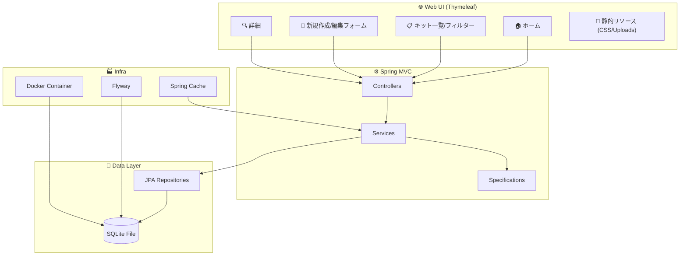

# 🤖 Gundam Collection Administrator 2.0

<div align="center">
  
</div>

<div align="center">

[](https://adoptium.net)
[](https://spring.io/projects/spring-boot)
[](https://www.thymeleaf.org/)
[](https://www.sqlite.org/)
[](https://flywaydb.org/)
[](https://www.docker.com/)

</div>

---

**ガンプラ（ガンダム）コレクションの完全な管理ツール**。キット登録、写真管理、フィルタリング、固定カタログ、簡易レポート機能を備えています。  
🎨 **RX-78-2をイメージしたUIテーマ**、**i18n 多言語対応 (PT/EN/JA)**、静的アップロードに対応。

---

## 📑 目次

- [🤖 Gundam Collection Administrator](#-gundam-collection-administrator-20)
  - [📊 プロジェクトデータ](#-プロジェクトデータ)
  - [🏗️ アーキテクチャ](#️-アーキテクチャ)
  - [📂 プロジェクト構造](#-プロジェクト構造)
  - [☕ プログラミング (Java Spring)](#-プログラミング-java-spring)
  - [🌐 Web機能](#-web機能)
  - [✨ 機能一覧](#-機能一覧)
  - [🗺️ ドメインモデリング](#️-ドメインモデリング)
  - [⚙️ 要件とセットアップ](#️-要件とセットアップ)
  - [🐳 Dockerでの実行](#-dockerでの実行)
  - [💻 ローカル実行 (Dockerなし)](#-ローカル実行-dockerなし)
  - [🤖 MCPサポート](#-mcpサポート)
  - [🛣️ 主なルート](#️-主なルート)
  - [📦 レイヤーとパッケージ](#-レイヤーとパッケージ)
  - [🔄 データベース移行](#-データベース移行)
  - [🛠️ トラブルシューティング](#️-トラブルシューティング)
  - [🚀 ロードマップ](#-ロードマップ)
  - [📄 ライセンス](#-ライセンス)

---

## 📊 プロジェクトデータ

- **名前**: 🤖 Gundam Collection Administrator
- **スタック**: Spring Boot 3.5, Java 17, Thymeleaf, Spring Data JPA, Flyway, SQLite, Gradle
- **デフォルトポート**: `8080`
- **データベース**: SQLite (`gundam.db`)
  - 📂 ホスト上の場所: `./database/gundam.db`
  - 🐳 コンテナ内の場所: `/app/data/gundam.db`
  - 📝 モード: WAL (Write-Ahead Logging) 有効
- **アップロードディレクトリ**: `uploads/` (`/uploads/**` で配信)
- **国際化 (i18n)**: 🇧🇷 `pt-BR`, 🇺🇸 `en`, 🇯🇵 `ja` (`?lang=` パラメータで切り替え)

---

## 🏗️ アーキテクチャ



---

## 📂 プロジェクト構造

- `src/main/java/br/com/gundam`
  - 🚀 `GundamApplication.java` — アプリケーションのブートストラップ
  - ⚙️ `config/` — `WebConfig` (静的リソース, i18n, ロケール), `CacheConfig`
  - 🎮 `controller/` — `HomeController`, `GundamKitController`
  - 🧠 `service/` — `GundamKitService`, `FileStorageService`
  - 💾 `repository/` — JPAリポジトリ (レポートクエリを含む)
  - 🔍 `spec/` — 動的フィルター用 Specification
  - 📦 `model/` — JPAエンティティ (GundamKit, Grade, Escala, AlturaPadrao, Universo)
- `src/main/resources`
  - 🖼️ `templates/` — Thymeleaf ビュー (`layout.html`, `home.html`, `kits/*`, `sobre.html`, `relatorios.html`)
  - 🎨 `static/css/` — スタイルシート (`global.css`)
  - 🔄 `db/migration/` — Flyway マイグレーション `V1..V5` (SQLite互換)
  - ⚙️ `application.yml` — アプリケーション設定
- 🐳 `compose.yaml` — アプリケーションコンテナのオーケストレーション
- 🐳 `Dockerfile` — Dockerイメージ定義
- 🤖 `mcp-settings.json` — Model Context Protocol 統合設定
- 🐘 `build.gradle` — 依存関係とプラグイン

---

## ☕ プログラミング (Java Spring)

- **Controllers (Spring MVC)**: ルートを処理し、`Model` を入力してテンプレート名を返します。
- **Services**: ビジネスロジックとキャッシュを集約します。
- **Repositories (Spring Data JPA)**: CRUD + `JpaSpecificationExecutor` + JPQLクエリ。
- **Configurations**: WebConfig (静的アップロード), CacheConfig。

---

## 🌐 Web機能

- **Thymeleaf テンプレート**: `layout.html` にベースレイアウト。
- **フィルター付き一覧**: `/kits` でのパラメトリックGETリクエスト。
- **アップロード**: 永続ボリュームに保存。

---

## 🐳 Dockerでの実行

プロジェクトを実行するための推奨される方法です。

### 前提条件

- Dockerがインストールされていること

### 手順

1. **アプリケーションの起動**:

   ```bash
   docker compose up -d --build
   ```

2. **アクセス**:
   - 🌐 Web: [http://localhost:8080](http://localhost:8080)

3. **データベースの確認**:
   - データベースファイルは自動的に `./database/gundam.db` に作成されます。
   - Flywayマイグレーションは起動時に自動的に実行されます。

### アプリケーションの停止

```bash
docker compose down
```

---

## 💻 ローカル実行 (Dockerなし)

Dockerを使用せず、ホスト (Windows/Linux/Mac) でGradleを使用して直接アプリケーションを実行する場合は、コンテナパス `/app/data` がマシン上に存在しないため、**データベースURLを上書き**してローカルファイルを指すようにする必要があります。

**コマンド (Windows Powershell):**

```powershell
.\gradlew.bat bootRun --args="--spring.datasource.url=jdbc:sqlite:./database/gundam.db"
```

**コマンド (Bash):**

```bash
./gradlew bootRun --args="--spring.datasource.url=jdbc:sqlite:./database/gundam.db"
```

> **注意**: Java 17がインストールされ、`JAVA_HOME` に設定されている必要があります。

---

## 🤖 MCPサポート

このプロジェクトには、**Model Context Protocol (MCP)** 用の設定ファイルが含まれています。

- **ファイル**: `mcp-settings.json`
- **設定**: このファイルの内容をMCPクライアント（例：Claude Desktop `config.json`）に追加してください。
- これにより、AIエージェントがデータベース構造を読み取り、`database/gundam.db` ファイルに対して直接クエリを実行できるようになります。

---

## ✨ 機能一覧

- ✅ **完全なキット登録** (モデル, メーカー, 価格, 購入日, 組立時間, URL, パッケージ/ボックス/組立写真)
- ✅ **固定カタログ**: グレード, スケール, 標準的な高さ
- ✅ **宇宙世紀/タイムライン** (UC, CE, AC, etc.) と詳細な備考
- 🔍 **一覧フィルター**: モデル (部分一致), グレード, 宇宙世紀, 購入期間, ページネーション
- 🖼️ **画像アップロード** (Dockerボリュームによる永続性保証)
- 🔄 **マイグレーション** (Flyway SQLiteモード) とシードデータ

---

## 🛠️ トラブルシューティング

- **⚠️ スキーマ検証エラー**:
  - `SchemaManagementException: wrong column type encountered` のようなエラーが表示される場合は、`application.yml` で `spring.jpa.hibernate.ddl-auto` が `none` に設定されているか確認してください。これは、Hibernateが `BIGINT` を期待しているのに対し、SQLiteが `INTEGER` を報告するために発生します。
  
- **🔒 書き込み権限**:
  - Dockerユーザーがホストの `./database` および `./uploads` フォルダに対する書き込み権限を持っていることを確認してください。

- **🚫 データベースロック**:
  - WALモードのSQLiteはロックを回避するはずですが、万が一発生した場合はコンテナを再起動してください。

---

## 📄 ライセンス

MIT.

Made with ❤️ using **Spring Boot** + **Thymeleaf**.
