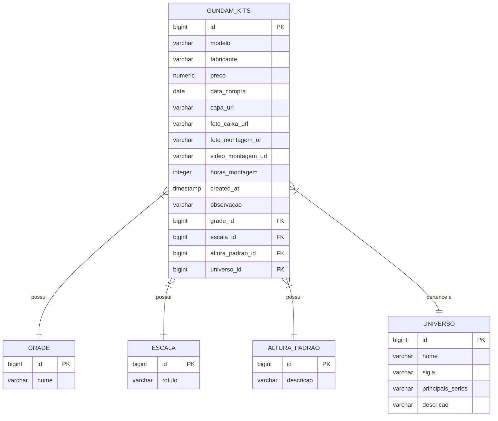

# Arquitetura do Projeto e Banco de Dados

## Visão Geral

O projeto **Gundam Administrator 2.0** é uma aplicação backend construída com **Spring Boot** (Java 17) gerenciada pelo **Gradle**.
Utiliza **PostgreSQL** como banco de dados relacional e **Flyway** para versionamento e migração do esquema do banco.

## Tecnologia do Banco de Dados

- **Banco de Dados**: PostgreSQL
- **Versão**: Latest (via Docker Compose)
- **Credenciais Padrão** (Dev):
  - **Host**: `localhost` (porta 5432)
  - **DB**: `gundam`
  - **User**: `gundam`
  - **Pass**: `gundam`
- **Ferramenta de Migração**: Flyway

## Esquema do Banco de Dados (ER Diagram)

## Detalhes das Tabelas

### 1. `gundam_kits` (Tabela Principal)

Armazena os dados dos kits de Gundam da coleção.

- `id`: Chave primária (bigserial).
- `modelo`: Nome do modelo (ex: "RX-78-2 Gundam").
- `fabricante`: Padrão 'Bandai'.
- `preco`: Valor pago.
- `universo_id`: FK para a tabela `universo` (Linha do tempo/Universo do kit).
- `grade_id`: FK para a tabela `grade` (ex: HG, MG, RG).
- `escala_id`: FK para a tabela `escala` (ex: 1/144).
- `altura_padrao_id`: FK para `altura_padrao` (estimativa de altura).
- `observacao`: Notas adicionais sobre o kit.

### 2. `universo`

Tabela de referência para os universos de Gundam.

- `nome`: Nome completo (ex: "Universal Century").
- `sigla`: Abreviação (ex: "UC").
- `principais_series`: Séries associadas.
- `descricao`: Breve descrição do contexto.

### 3. `grade`

Classificação do kit (Grade).

- `nome`: (ex: "HG (High Grade)", "MG (Master Grade)").

### 4. `escala`

Proporção do modelo.

- `rotulo`: (ex: "1/144", "1/100").

### 5. `altura_padrao`

Faixa de altura típica para referência.

- `descricao`: (ex: "12 - 15 cm").

## Estrutura de Diretórios

- `src/main/java`: Código fonte Java (Controllers, Services, Repositories, Entities).
- `src/main/resources/db/migration`: Scripts SQL do Flyway (`V1__...`, `V2__...`).
- `docker-compose.yaml`: Configuração do container PostgreSQL.
